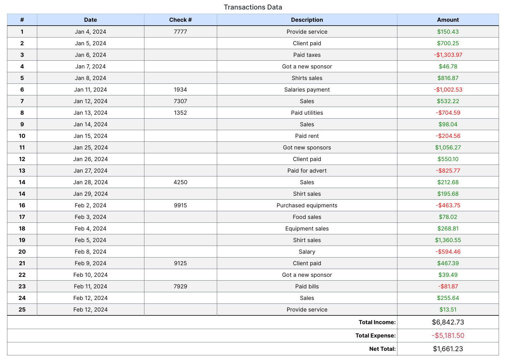
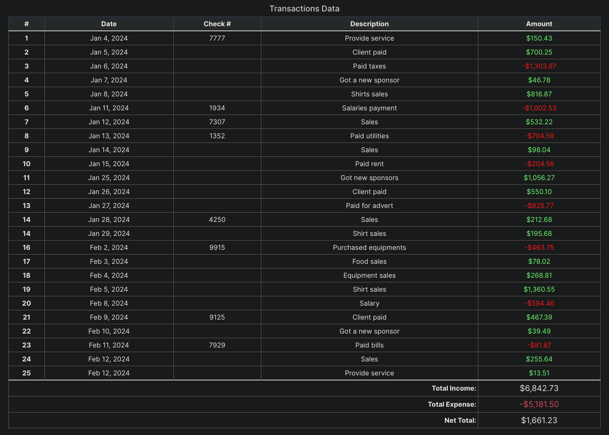

# CSV Transaction Parser

`Procedural PHP` `FILE/IO` `Data Parsing`


### Overview

This project is designed to read transaction(s) data from CSV files, parse the data,
and display it in a html table in a web browser. This project is ideal for practicing
procedural PHP programming and gaining experience in handling file input/output and
data parsing.


### Features

- Read transaction data from CSV files.
- Parse, format and extract the data.
- Display transactions data in a user-friendly html table in a web browser.


### Getting Started

To get started using this transaction parser, follow these steps:

- Clone this repository to your local machine:
   ```bash
    git clone https://github.com/gbabohernest/csv_transactions_parser.git

- Open the project in your preferred text editor or IDE.


- Place your csv transaction file(s) in the designated directory.
  - modify the `index.php` file to specify the correct path to your csv file
  and give the full path as an argument to the function `getCsvTransactionsFile($dirPath)`.
  

- Start a local server `(e.g using PHP's built-in server)`
    ```bash
    php -S localhost:8000
 
 Open your favorite web browser and navigate to `http://localhost:8000` to view the parsed
 transaction(s) data in a html table.
 
Upon accessing the application via the browser, the `CSV Transactions Parser` will automatically
read and parse the csv files located in the designated directory and display the parsed data
in the web browser.


### Contributing

Contributions are welcome! If you find any issues or have suggestions for improvements,
feel free to open an issue or create a pull request.


#### Test Outputs



